# panelViewStata
## Weekly Report 01
Jun 20 2019

Here's the latest report. Please note some of the options are not stable. `panelViewSc` is the most stable for now.

We use `panelView` to see the outcome of panel data:
```
use turnout.dta, replace
panelView turnout policy_edr abb year
```
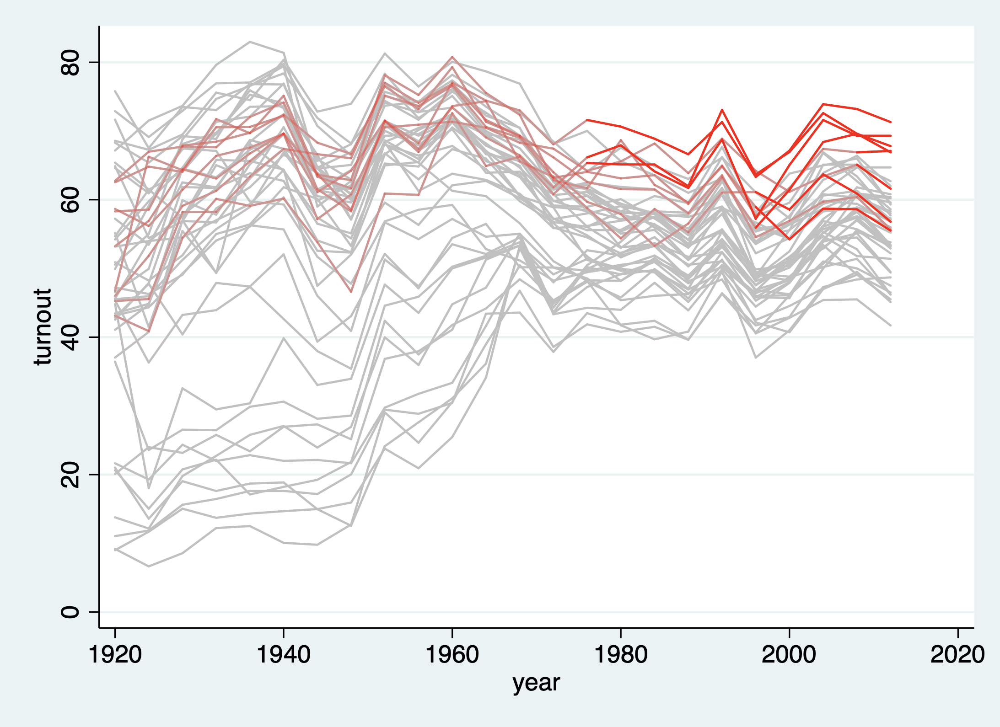
***
This version accomodates up to three treatment levels, by adjusting the transparency of treatment group lines, and adding a new color.

Just for demostration purposes, we add a treatment level on `turnout`:

```
replace policy_edr = 2 if abb == "CA" & year > 1960
panelView turnout policy_edr abb year
```

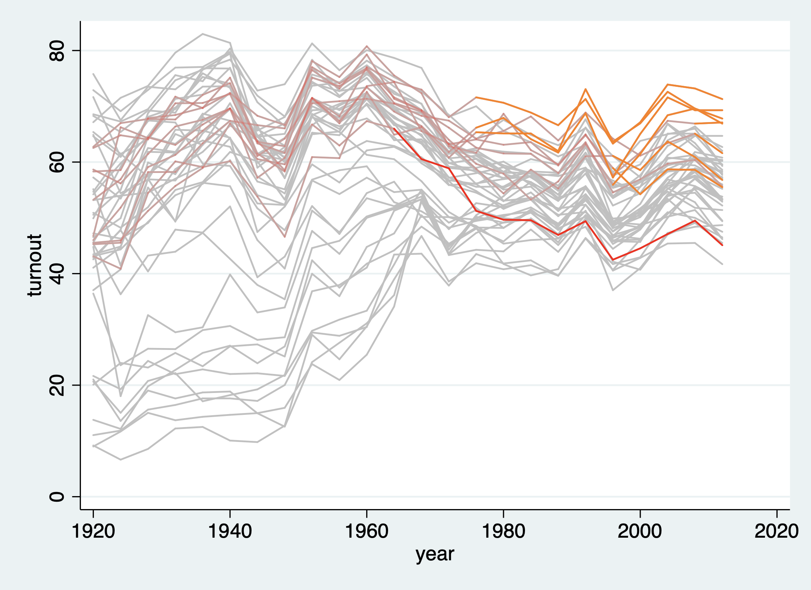


Let's try it on the capacity data:
```
use capacity.dta, replace
panelView lngdp demo ccode year
```
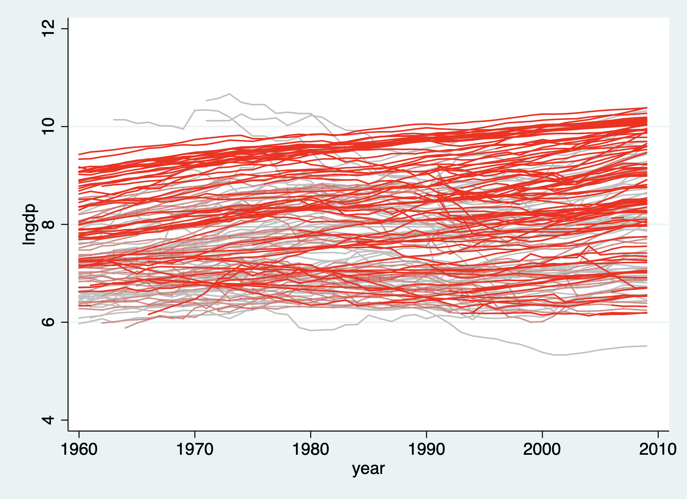

Note that there are straight lines crossing over countries. The reason to this is that this function cannot deal with switched-back treatments very well. Lets look at one country, Argentina, that switched between democracy and non-democracy multiple times:

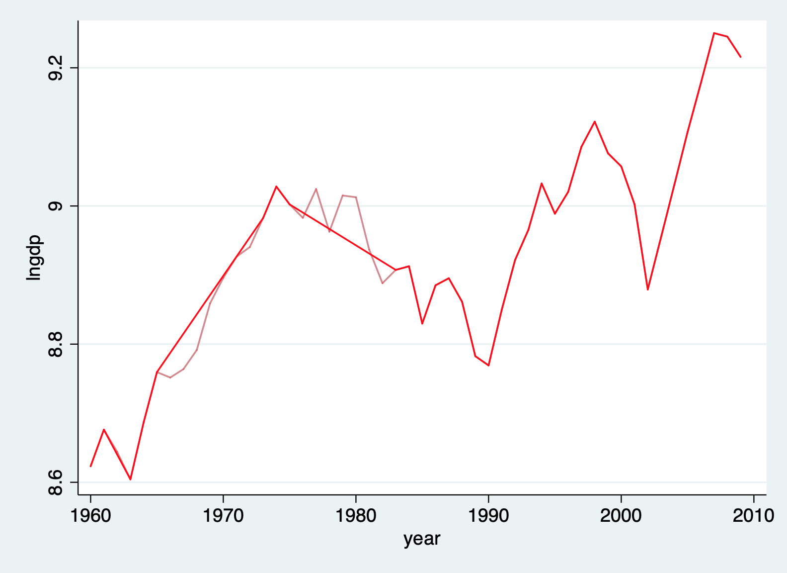

You can designate color by adding a `mycolor()` option:
```
use turnout.dta, replace
panelView turnout policy_edr abb year, mycolor(green)
```
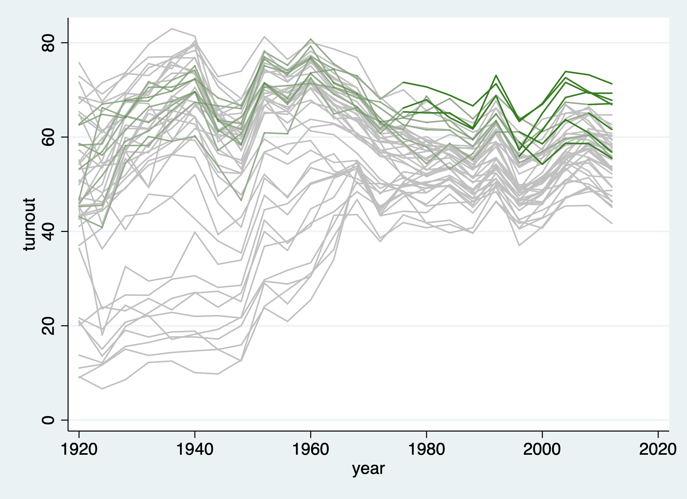
***
***

To show treated or untreated, we use a seperate function `panelHmap`.

```
use turnout.dta, replace
panelHmap year abb policy_edr
```
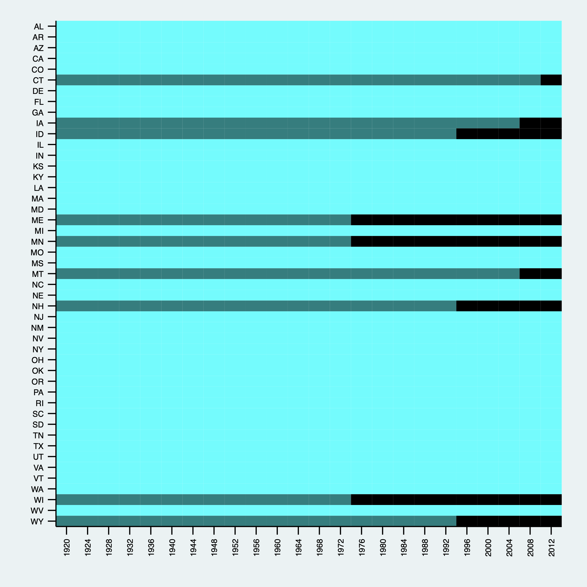

Note the `prepost` option is already turned on. Due to some mysterious STATA language restrictions, we cannot turn off `prepost` without totally deleting this chunk of code. The next part we will test it in the previous version.

```
use turnout.dta, replace
panelHmap year abb policy_edr
```
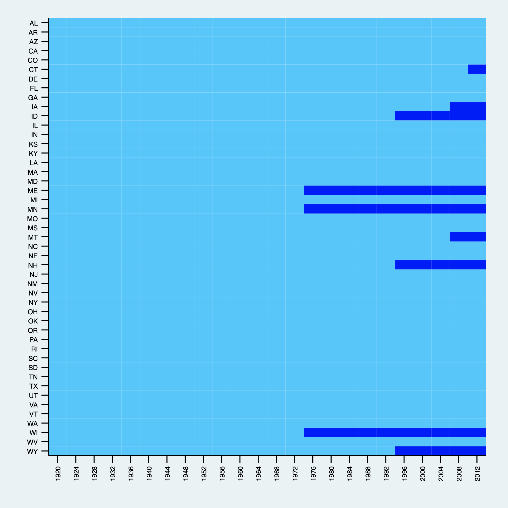

We can also use it in `capacity` data:

```
use capacity.dta, replace
panelHmap year country demo,  title("demo score hmap", size(small)) xlabel()
```

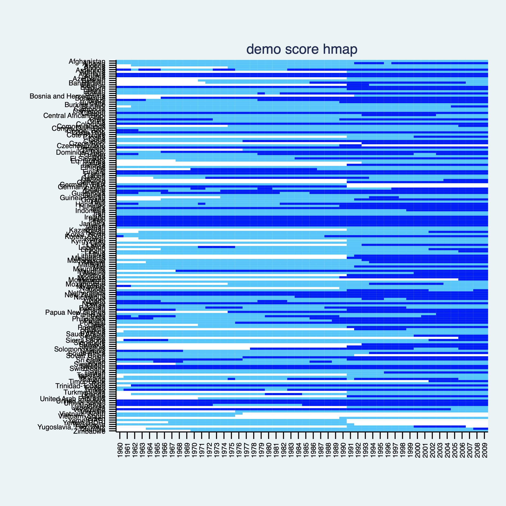

It can also deal with continuous treatment, or any variable, if you specify `continuous`:

```
use capacity.dta, replace
panelHmap year ccode polity2, continous title("polity2 score hmap", size(small)) xlabel()
```
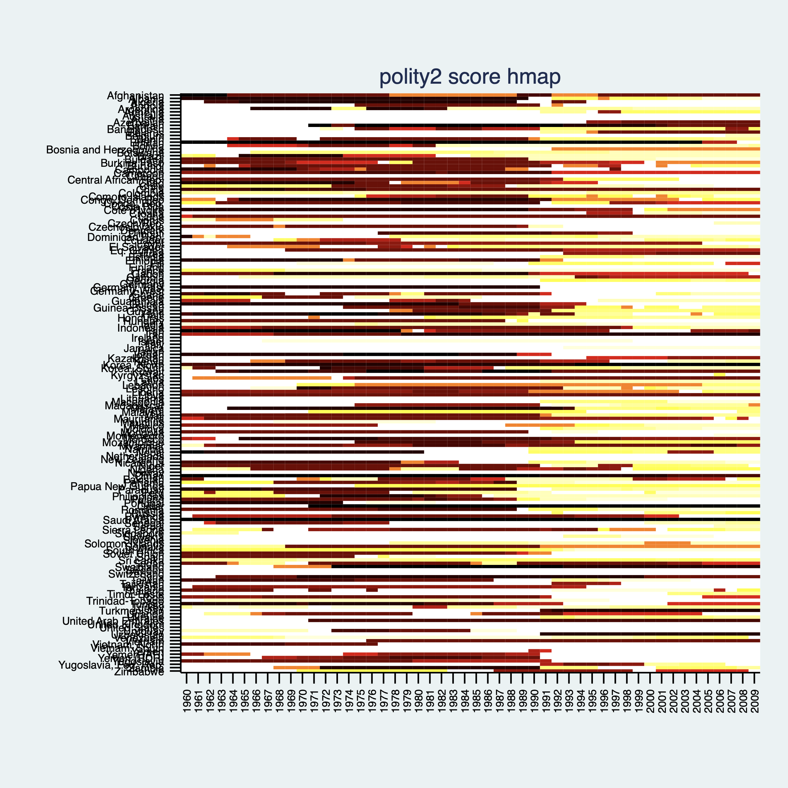


```
panelHmap year country demo if year >= 1990,  title("demo score hmap", size(tiny)) xlabel(1990(1)2009)
```

***

Finally, take a look at the experimental discrete panel data visualization. Again, it's not yet integrated into the panelView function. We use a seperate function `panelViewSc`.

```
use simdata.dta, replace
panelViewSc Y D id time
```
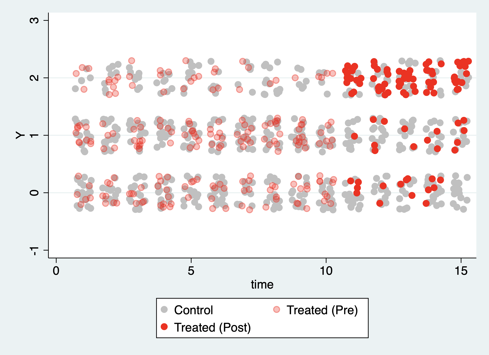

You can only plot a subset of the data:
```
panelViewSc Y D id time if time > 7
```
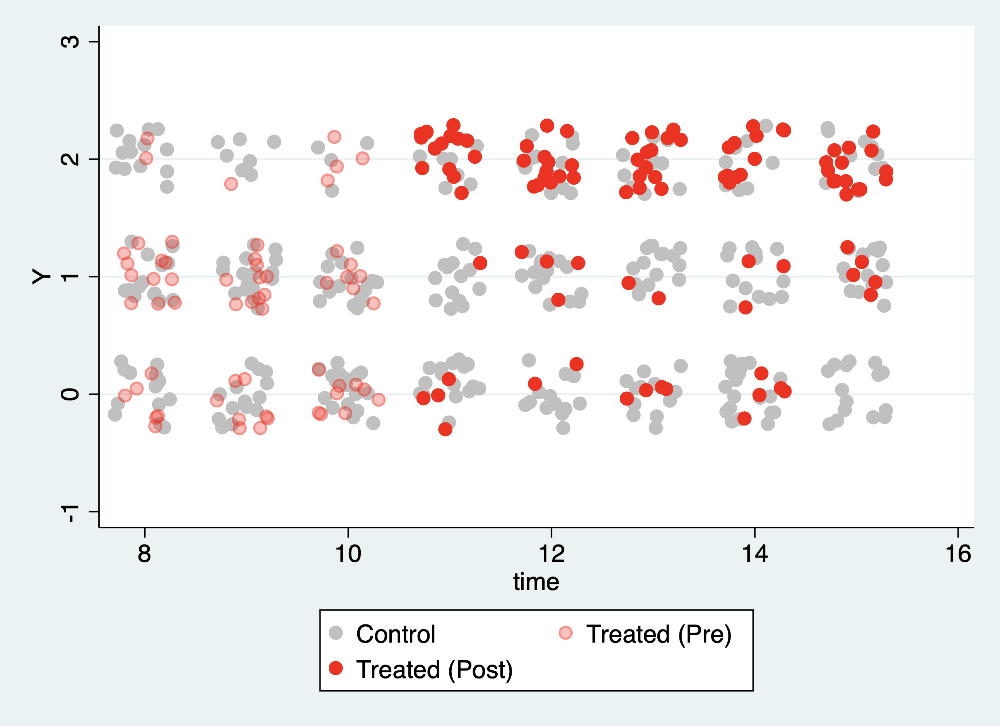


And choose your color:
```
panelViewSc Y D id time if time > 7, mycolor(green)
```
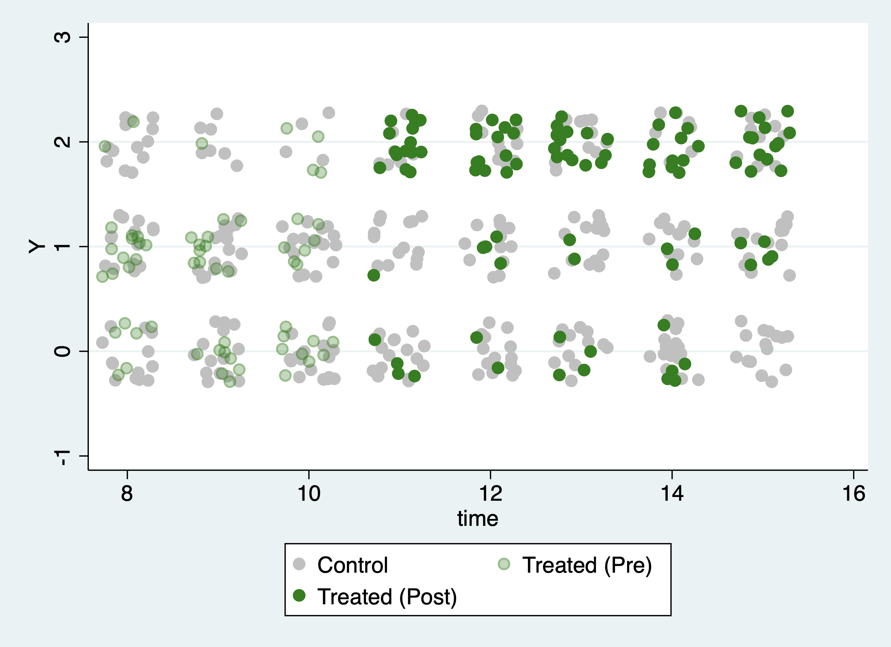
