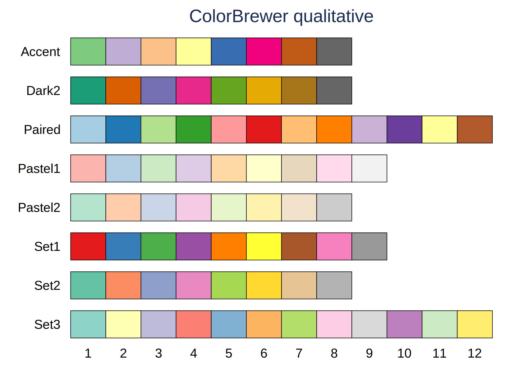
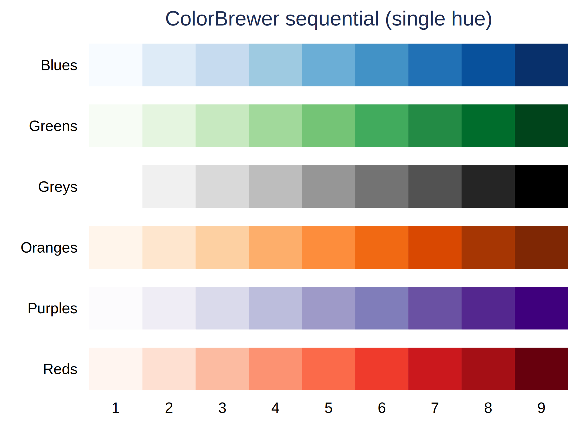
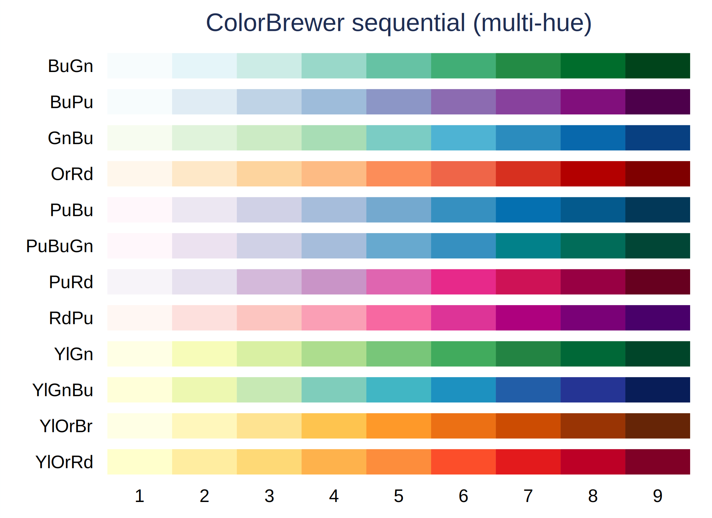
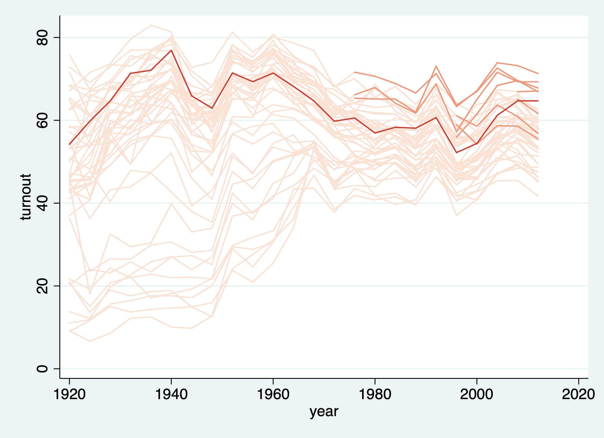
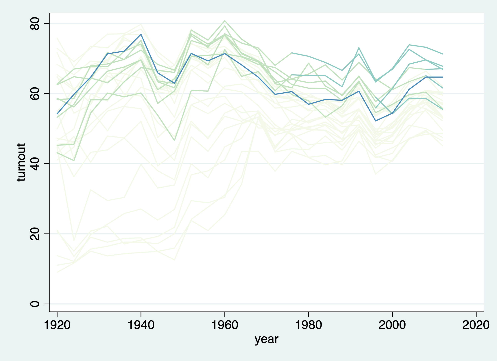
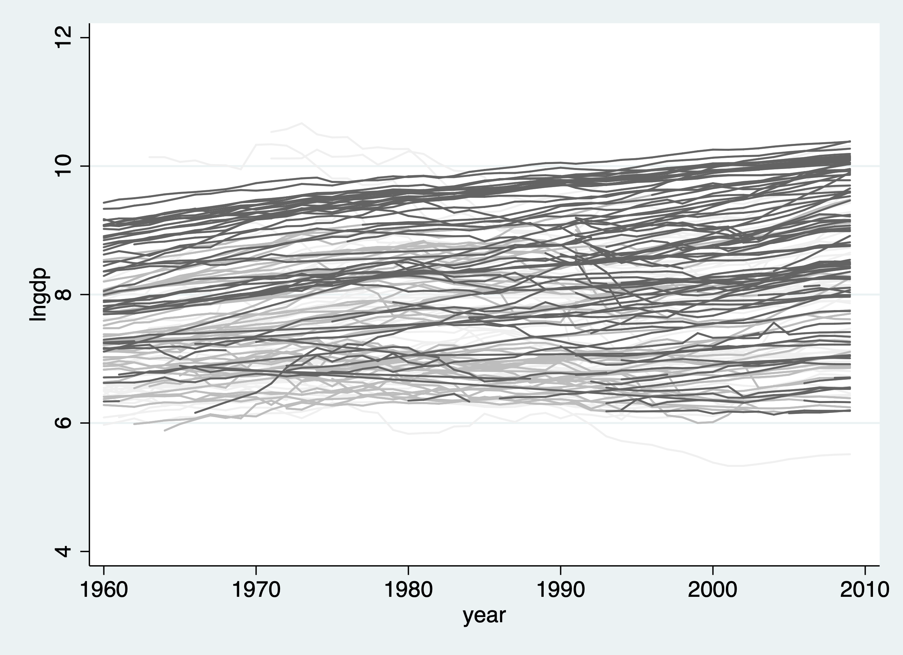
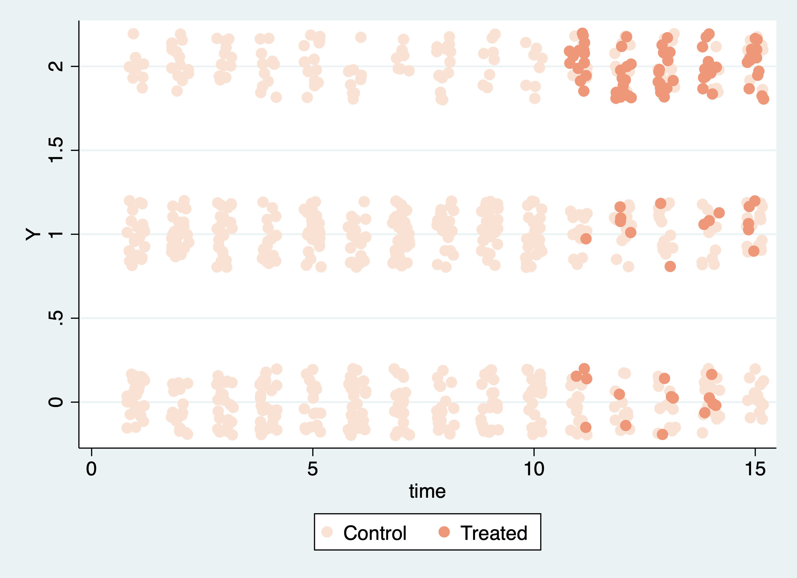
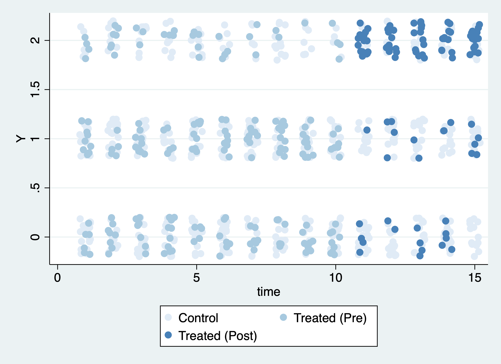
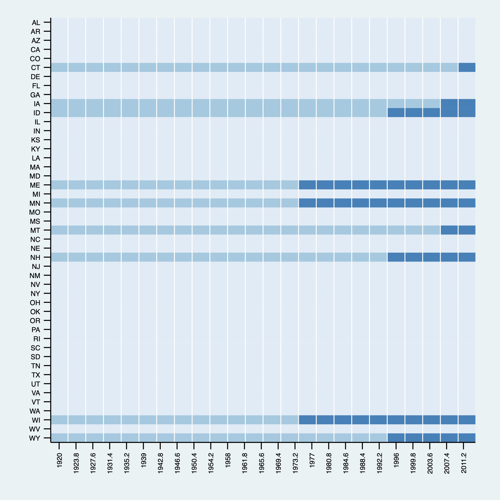
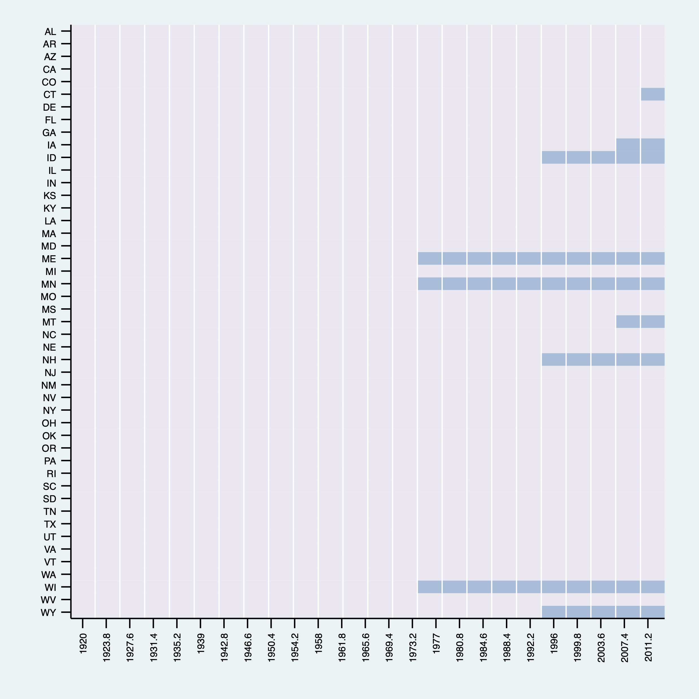

# panelViewStata
## Weekly Report 02
Jun 30 2019

***
### Update
* `panelView`, `panelHmap` and `panelViewSc` are all integrated into `panelViewAll`.
* Using `colorpalette` to generate levels of color. Now, up to 7 levels of treatment is supported.
* Fixed "treated then untreat" problem.

***
In this updated version, we use color norms in `colorpalette` to designate color schemes.





You can refer to the document of `colorpalette` [here](http://repec.sowi.unibe.ch/stata/palettes/colors.html).

We use `panelViewAll` to see outcome of panel data. By default, it displays continuous outcome. The order of the function input is:

```
panelViewAll "treatment" "ids" "time_unit" "outcome" [if] [in]
```
Just a quick example:
```
use turnout.dta, replace
replace policy_edr = 2 if abb == 5
panelViewAll policy_edr abb year turnout, prepost(off)
```


We can specify a subset of the data by adding an `if`, and choose your favorite color scheme if it's in ColorBrewer, and turn on `prepost`:
```
use turnout.dta, replace
replace policy_edr = 2 if abb == 5
panelViewAll policy_edr abb year turnout if abb <= 20 , mycolor(GnBu)
```


Now, if treatment level goes to 1 then goes back to 0, there won't be strangely connected lines. Also, let's try greyscale color scheme:
```
use capacity.dta, replace
panelViewAll demo country year lngdp , mycolor(Greys)
```



To see discrete outcome of panel data, we just add `discrete` option:
```
use simdata.dta, replace
panelViewAll D id time Y , discrete prepost(off)
```


Still, the default scheme is `Reds`. We can change to `Blues`, and turn on `prepost`:

```
use simdata.dta, replace
panelViewAll D id time Y , mycolor(Blues) discrete
```

***

If you just want the treatment condition displayed, simply remove the `"outcome"` variable. You can also customize the color scheme. The gaps between the color bricks are enlarged:
```
use turnout.dta, replace
panelViewAll policy_edr abb year , mycolor(Blues)
```


You can turn off the `prepost` option:

```
use turnout.dta, replace
panelViewAll policy_edr abb year , mycolor(PuBu) prepost(off)


```



***

### What I am still working on:

* `bytime` sorting;
* Slicing continuous treatment so that it can work with existing `colorpalette`;
* Assertions.
