# panelViewStata
## Weekly Report 03
Jul 14 2019

***
### Update
* `panelViewAll`is changed to `panelView`.
* Using `sencode` generate `bytiming` option.
* Improved continuous treatment plotting.
* Checking dependent packages.
* Integrated with existing `xtset` function.


The latest syntax:

```
panelView Y D,
i(varname)
t(varname numeric)
type(string)
discrete
bytiming
mycolor(string)
prepost(string)
continuoustreat
*
```
First, please note that we can just use the existing STATA plotting option to remove or customize y-axis title, legend, etc.
```
use simdata.dta, replace
panelView Y D , type(outcome) i(id) t(time) mycolor(Greens) discrete ytitle("haha my y title here") title("See the new syntax here")
```
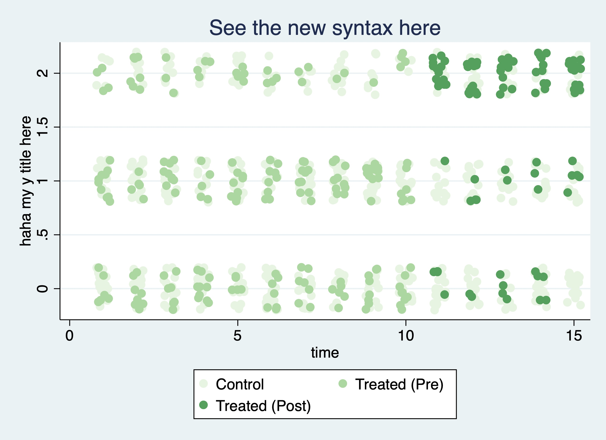


***
This version we check if user has already set panel and time variable with `xtset`, and inherit that setting if available:
```
use capacity.dta, replace
xtset country year
```
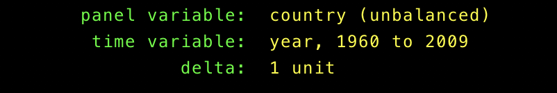
Now we just use that setting:
```
panelView lngdp polity2 ,type(treat)  continuoustreat mycolor(Reds) ///
prepost(off) ylabel("") xlabel("") title("How's Continuous Treat Mappin Working?")
```
Note that we use a continuous treatment `polity2` here. We map it to a 9 level color palette in the plot. Here's how it looks:
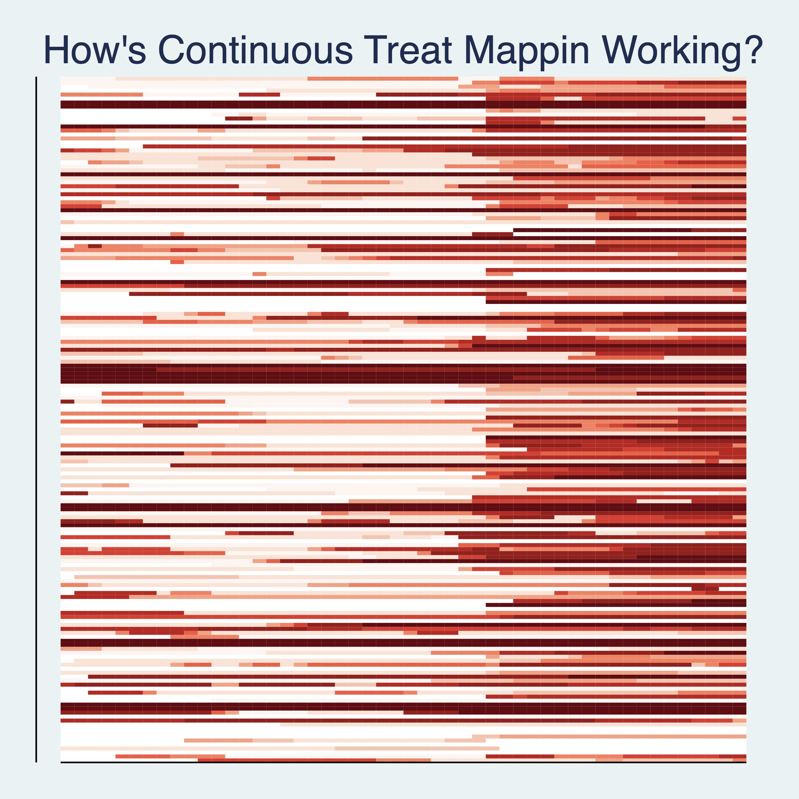


Now we can use the `bytiming` to sort the plot by the first time an id is treated. Simply add `bytiming` to the options:
```
use turnout.dta, replace
panelView turnout policy_edr, type(treat) i(abb) t(year) mycolor(PuBu) bytiming prepost(off) ylabel("") title("How's bytiming working?")
```
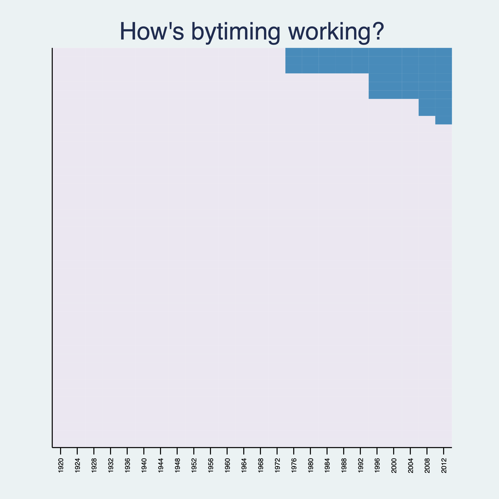


***
### Jun 30 Version
In this  version, we use color norms in `colorpalette` to designate color schemes.

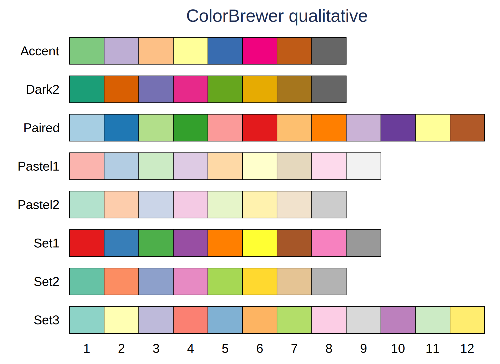
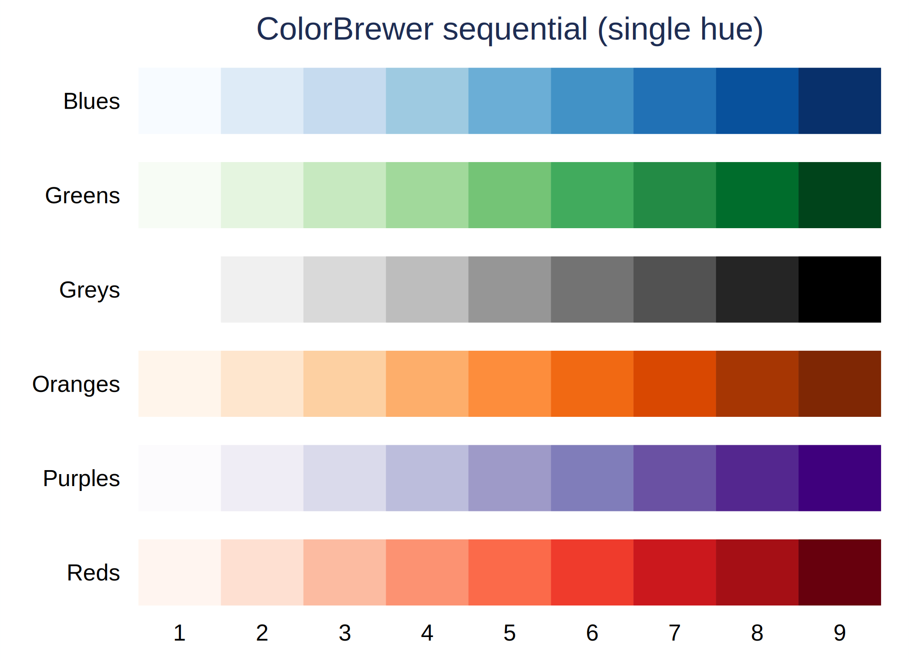
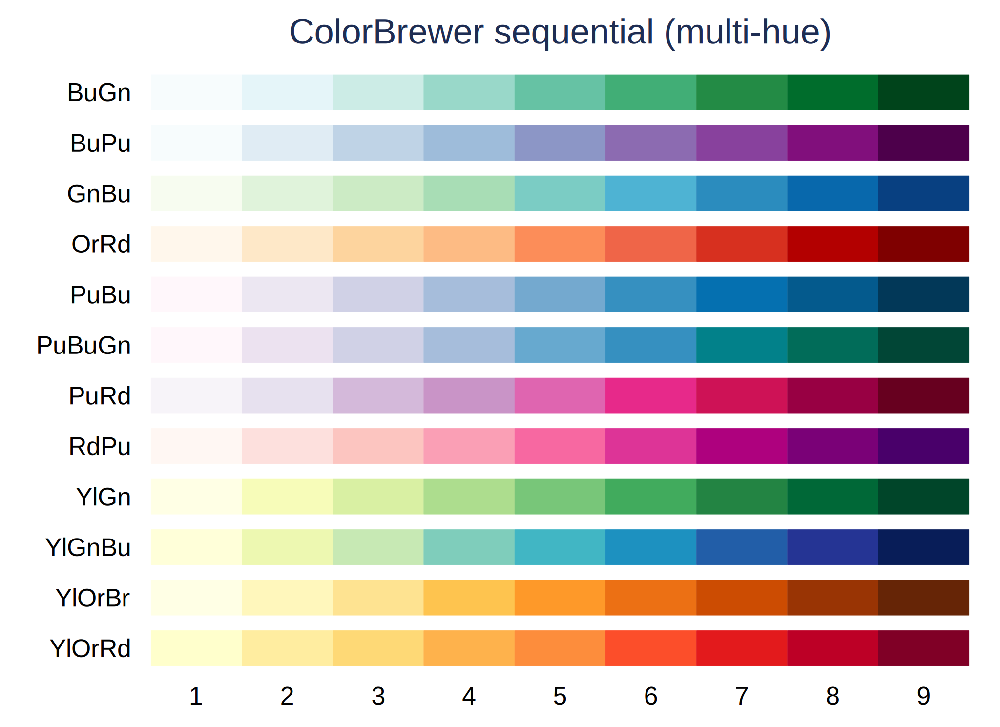

You can refer to the document of `colorpalette` [here](http://repec.sowi.unibe.ch/stata/palettes/colors.html).

We use `panelViewAll` to see outcome of panel data. By default, it displays continuous outcome. The order of the function input is:

```
panelViewAll "treatment" "ids" "time_unit" "outcome" [if] [in]
```
Just a quick example:
```
use turnout.dta, replace
replace policy_edr = 2 if abb == 5
panelViewAll policy_edr abb year turnout, prepost(off)
```
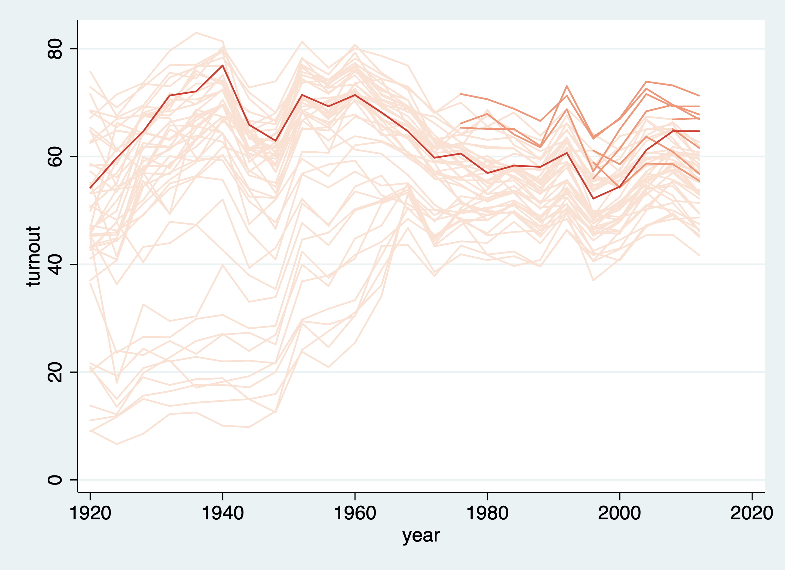

We can specify a subset of the data by adding an `if`, and choose your favorite color scheme if it's in ColorBrewer, and turn on `prepost`:
```
use turnout.dta, replace
replace policy_edr = 2 if abb == 5
panelViewAll policy_edr abb year turnout if abb <= 20 , mycolor(GnBu)
```
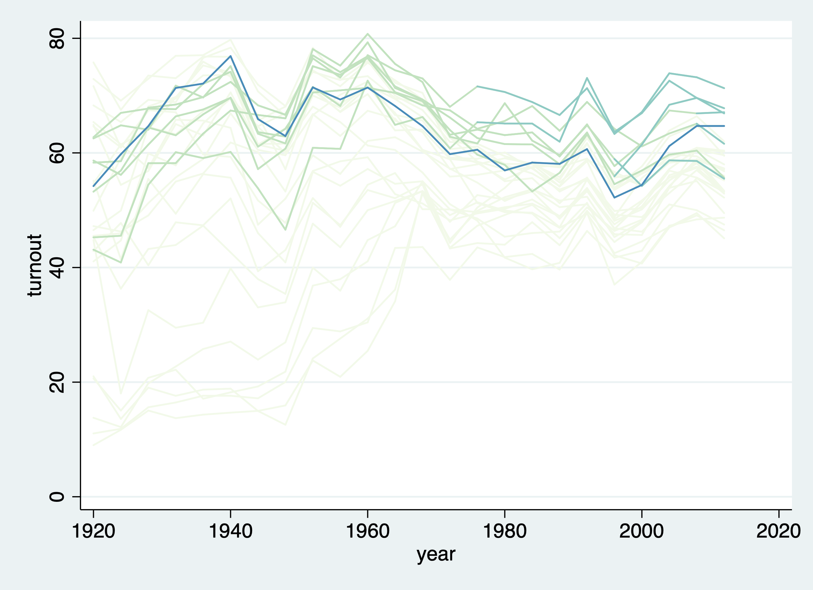

Now, if treatment level goes to 1 then goes back to 0, there won't be strangely connected lines. Also, let's try greyscale color scheme:
```
use capacity.dta, replace
panelViewAll demo country year lngdp , mycolor(Greys)
```
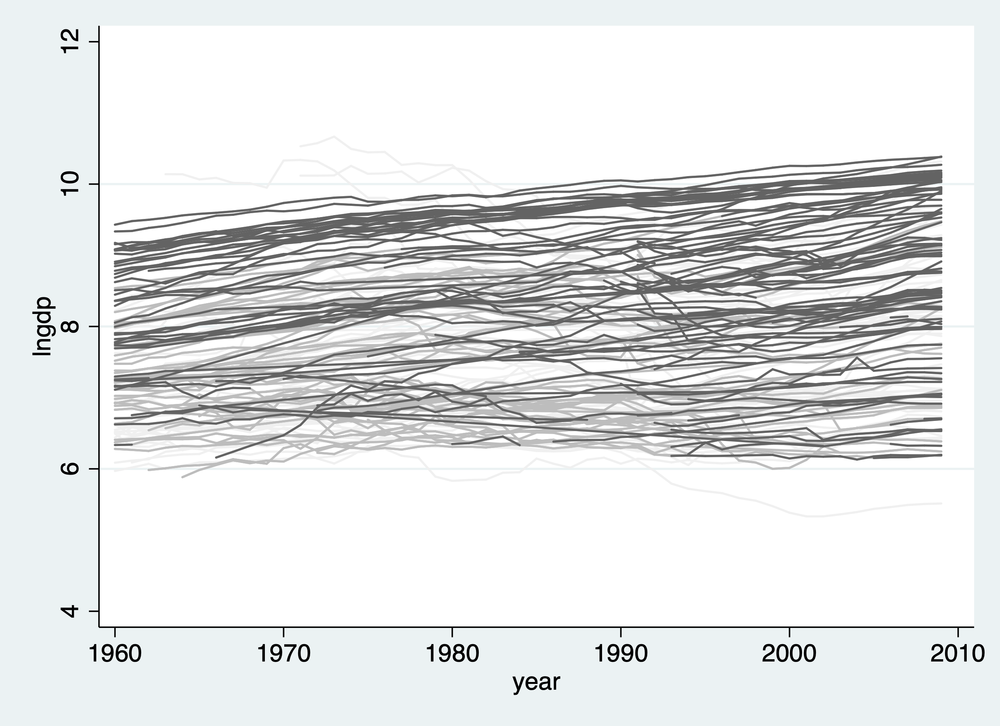


To see discrete outcome of panel data, we just add `discrete` option:
```
use simdata.dta, replace
panelViewAll D id time Y , discrete prepost(off)
```
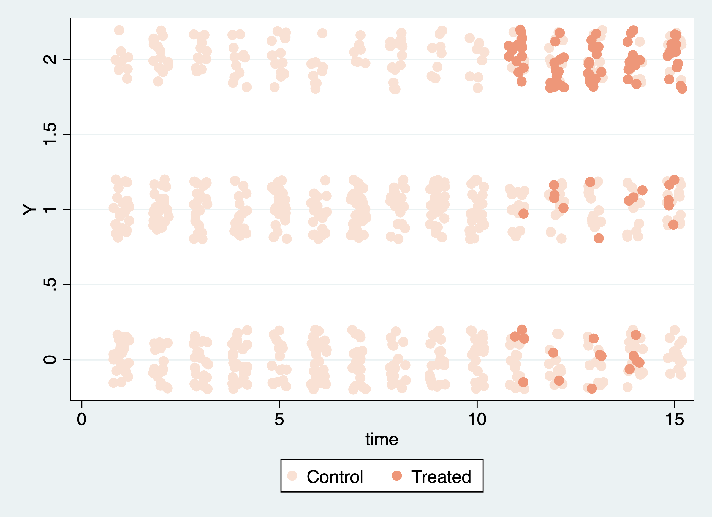

Still, the default scheme is `Reds`. We can change to `Blues`, and turn on `prepost`:

```
use simdata.dta, replace
panelViewAll D id time Y , mycolor(Blues) discrete
```
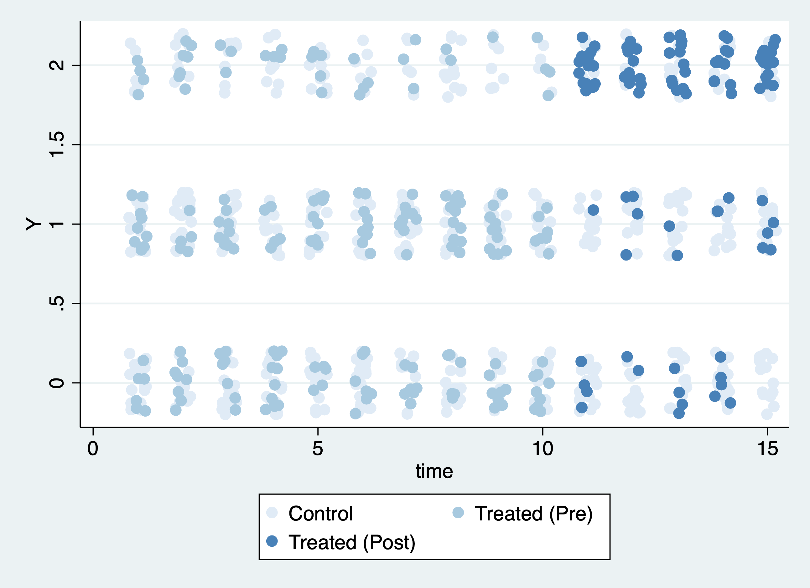
***

If you just want the treatment condition displayed, simply remove the `"outcome"` variable. You can also customize the color scheme. The gaps between the color bricks are enlarged:
```
use turnout.dta, replace
panelViewAll policy_edr abb year , mycolor(Blues)
```
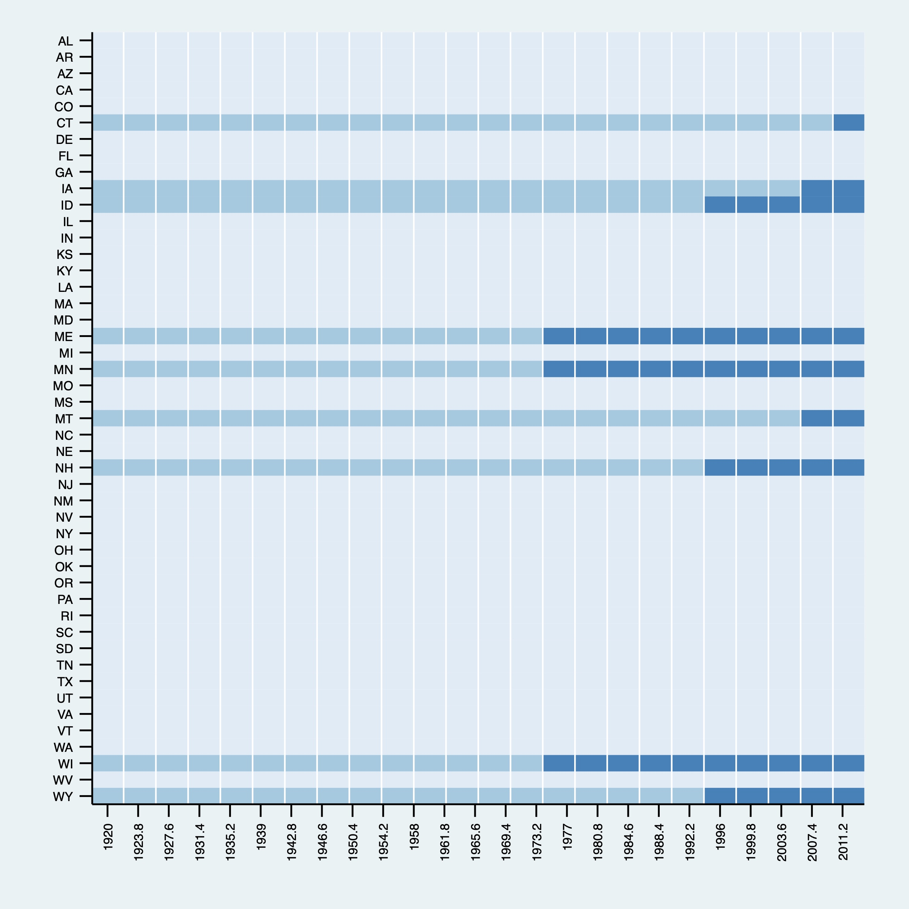

You can turn off the `prepost` option:

```
use turnout.dta, replace
panelViewAll policy_edr abb year , mycolor(PuBu) prepost(off)


```
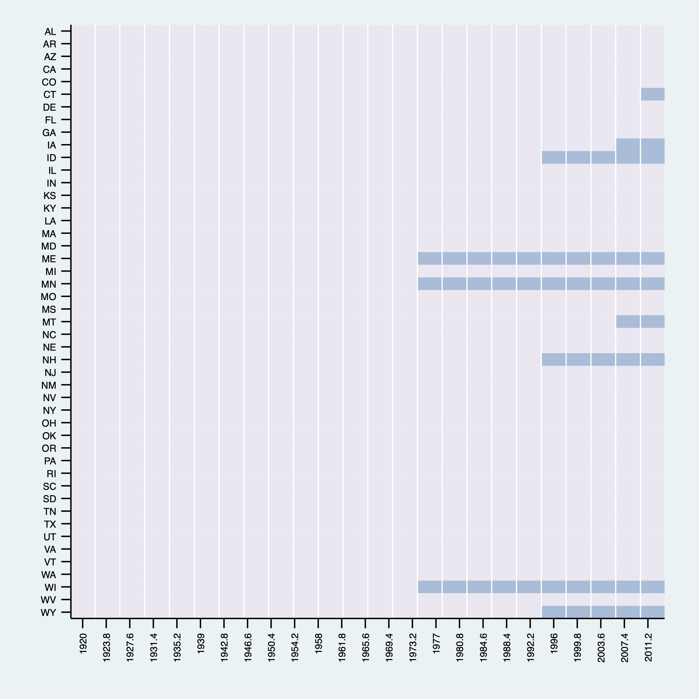


***

### What I am still working on:

* `bytime` sorting;
* Slicing continuous treatment so that it can work with existing `colorpalette`;
* Assertions.
